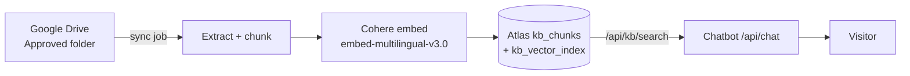

# Integration — Google Drive Knowledge Base

Plan for letting Solar Works staff **drop files into a Google Drive folder** and have
the [[Integration - AI Lead Chatbot|Solar Assistant]] answer from them in production,
with MongoDB Atlas remaining the database.

> [!summary] Answer: yes, with one correction
> Drive works as the **source of record** that staff edit. It cannot be the thing the
> chatbot queries at runtime. Files get synced into the existing `kb_chunks` collection
> in Atlas, which is what retrieval already reads. Staff experience is exactly what was
> asked for — drop a file in Drive, the chatbot knows it — and nothing about retrieval,
> the guardrails or the lead flow changes.

## Why Drive can't be the runtime database

- The chatbot matches a visitor's question by **meaning**, not keywords: it embeds the
  question and runs Atlas `$vectorSearch` against stored vectors. Drive has no embeddings
  and no vector index, so there is nothing to search against.
- Retrieval happens **inside the visitor's request**. Drive API auth, listing and file
  download per turn would add seconds of latency and a second quota to run out of.
- The guardrails depend on a **similarity score** (`KB_MIN_SCORE`, currently 0.75) to
  decide "answer from this" vs "escalate to an adviser". A raw Drive document produces no
  score, so the §8.3 red lines could not be enforced.

So Drive is upstream of the database, not a replacement for it:



## What already exists — do not rebuild

Everything from the Drive folder rightwards is built and verified (see
[[Chatbot RAG and n8n — Progress and Resume]]). This plan adds **only the left-hand box**.

| Piece | Where | Status |
| --- | --- | --- |
| Chunk storage + `$vectorSearch` | `solarworks-platform/lib/kb.ts` (`kb_chunks`) | Built |
| Cohere embedding wrapper | `lib/embeddings.ts` (1024 dims, `search_document` vs `search_query`) | Built |
| Vector index | `kb_vector_index`, created by `pnpm kb:index` | Built |
| Ingest script (hardcoded source) | `scripts/seed-kb.ts` + `lib/kb/source-content.ts` | Built — becomes the fallback |
| Retrieval endpoint | `app/api/kb/search/route.ts`, shared secret `x-kb-key` | Built |
| Retrieval telemetry | `kb_queries` (grounded vs escalated per question) | Built |
| Chatbot consumption | `solarworks-landingpage/lib/kb-search.ts` | Built |

**Consequence:** the chunk contract is already fixed, and the Drive sync must produce the
same shape — `chunkId`, `category`, `question`, `content`, `embedding`, `updatedAt`.

## Drive folder convention

```
Solar Works KB/
├── Approved/            ← the ONLY folder that is ever ingested
│   ├── faq-cost/
│   ├── faq-net-metering/
│   ├── solution-grid-tied/
│   └── policy/
└── Drafts/              ← ignored by the sync entirely
```

- **Subfolder name = category slug**, matching `KbCategory` in `lib/kb/source-content.ts`.
  An unknown subfolder name is skipped and reported, never guessed.
- **File formats:** Google Docs (exported as `text/plain`), `.md`, `.txt` in phase 1.
  PDF and DOCX in phase 2 — both need a parser and neither is worth blocking on.
- **One idea per section, not per file.** A file is split into chunks on headings and
  blank lines, each 50–200 words, matching the hand-written chunks that tested at 20/20.
  First line of a section becomes `question`, the remainder becomes `content`.
- **Stable IDs:** `chunkId = drive:<fileId>:<sectionIndex>`. Renaming a file keeps its
  `fileId`, so renaming does not orphan its chunks.

## Governance — the real risk in "anyone can drop data"

> [!warning] This is the part to decide before building
> The chatbot's whole design is that it answers **only** from approved content, never
> gives figures, and never quotes a price ([[Integration - AI Lead Chatbot]] guardrails,
> build guide §8.3). A folder that anyone can write to is a folder in which anyone can
> put a price into the chatbot's mouth. The sync cannot tell an approved fact from a
> sales note someone parked there.

Mitigations, in the order they matter:

1. **Only `Approved/` is ingested.** Drafting happens in `Drafts/`, which the sync ignores.
2. **Write access to `Approved/` is restricted** to a named content owner (Drive
   permissions, not an honour system). Everyone else gets comment/view on it.
3. **Every sync is logged** to a `kb_sync_runs` collection — what changed, added, removed,
   and which file it came from — so a bad answer can be traced to a document and a date.
4. **The threshold stays.** Retrieval still has to clear `KB_MIN_SCORE`, and the §8.3
   refusals still live in the system prompt, above anything retrieval supplies.
5. **Pricing red line unchanged:** the "we don't quote before an assessment" chunk stays
   authoritative even if someone uploads a price list.

## Change detection and embedding cost

Each chunk carries `sourceFileId`, `sourceModifiedTime` and `contentHash`. The sync
re-embeds a chunk **only when its hash changes**. Without this, every run re-embeds the
whole KB and pays Cohere for text that didn't change.

**Deletion rules** (Drive is the source of truth, so removals must propagate):

- A file's chunk count shrinks → delete that file's chunks with a higher index.
- A file is deleted, trashed, or moved out of `Approved/` → delete all its chunks.
- **Abort rule:** if the Drive listing errors, or returns **zero** files, the run aborts
  and deletes nothing. Otherwise one bad API response silently empties the knowledge base
  and the chatbot goes quiet for every factual question.

## Trigger options

| Option | Verdict |
| --- | --- |
| **Vercel Cron** → `POST /api/kb/sync` | **Production default.** Hobby is capped at **once per day** with ±59 min precision; Pro allows **once per minute**. Hobby is fine paired with the manual button below. |
| **Manual "Sync knowledge base" button** in the back office | **Required.** A content owner who fixes a wrong answer cannot wait up to a day. Calls the same route, shows the run summary. |
| **n8n Google Drive Trigger** → `POST /api/kb/ingest` | Local sandbox / learning only. The n8n instance is local ([[n8n local sandbox]]), so production Vercel cannot reach it and it only runs while that machine is on. Not a production path. |

All three call the same code. The sync logic lives in the platform (typed, testable,
already holds the Mongo connection and the Cohere key), never in n8n.

## Auth

A **Google service account** with read-only Drive scope, with `Approved/` shared to the
service account's email address. No OAuth consent screen, no browser round trip, works
headless on Vercel — unlike the interactive OAuth2 credential n8n would use.

> [!note] The usual service-account trap doesn't apply here
> Service accounts have no Drive storage quota of their own, which breaks *uploads*. This
> integration only ever **reads**, so it is unaffected.

New env vars (both `.env` and `.env.example`, never committed with values):

| Var | Purpose |
| --- | --- |
| `GOOGLE_SERVICE_ACCOUNT_EMAIL` | Service account identity |
| `GOOGLE_SERVICE_ACCOUNT_KEY` | Private key, base64-encoded to survive line breaks |
| `KB_DRIVE_FOLDER_ID` | The `Approved/` folder ID — deny-by-default when unset |
| `KB_SYNC_KEY` | Shared secret on `/api/kb/sync`, same pattern as `KB_SEARCH_KEY` |

Unset `KB_DRIVE_FOLDER_ID` = sync disabled, matching how `N8N_LEAD_WEBHOOK_URL` and
`LEADS_INGEST_KEY` already gate their features.

## Phases

| # | Deliverable | Done when |
| --- | --- | --- |
| 1 | `lib/kb/drive.ts` — list + export files from `Approved/` | A script prints every file, category and section count from Drive |
| 2 | `lib/kb/chunker.ts` — text → chunks + hashes | Re-running on unchanged text yields identical `chunkId`s and hashes |
| 3 | `POST /api/kb/sync` — diff, embed changed, upsert, delete orphans, write `kb_sync_runs` | A Drive edit is live in `kb_chunks` after one call; a deleted file's chunks disappear; an empty listing aborts |
| 4 | Vercel Cron entry + back-office "Sync now" button with last-run summary | Content owner can publish without a developer |
| 5 | Re-run `pnpm test:kb` against Drive-sourced chunks | Still 20/20 at threshold 0.75 |
| 6 | PDF/DOCX extraction | Optional, only if staff actually keep content in those formats |

**Rollback:** `lib/kb/source-content.ts` and `pnpm seed:kb` stay in the repo. If the Drive
path misbehaves, re-seeding restores a known-good KB in one command.

## Costs

| Item | Cost |
| --- | --- |
| Google Drive | ₱0 — existing Workspace/personal storage |
| MongoDB Atlas | ₱0 extra — vector search runs on the existing cluster, no separate charge |
| Cohere embeddings | Per changed chunk only; a full 40-chunk re-embed is negligible |
| Vercel Cron | Included on all plans; frequency is the only plan difference |

> [!note] Unrelated but binding: the chatbot's LLM budget
> Groq's free tier for `openai/gpt-oss-120b` is **200K tokens/day** (and 8K/minute). At
> roughly 2.6K tokens per turn that is ~75 conversation turns per day for the whole site,
> which testing alone exhausted on 2026-07-26. Switching to `llama-3.3-70b-versatile`
> would make it worse — higher TPM (12K) but **half** the daily budget (100K). Fixing
> this is a paid-tier or prompt-size question, not a Drive question.

## Related

- [[Integration - AI Lead Chatbot]]
- [[Chatbot RAG and n8n — Progress and Resume]]
- [[Integration - Google Sheets Lead Database]]
- [[Tech Stack and Architecture]]
- [[Non-Functional Requirements]]
- [[MOC - Integrations]]
