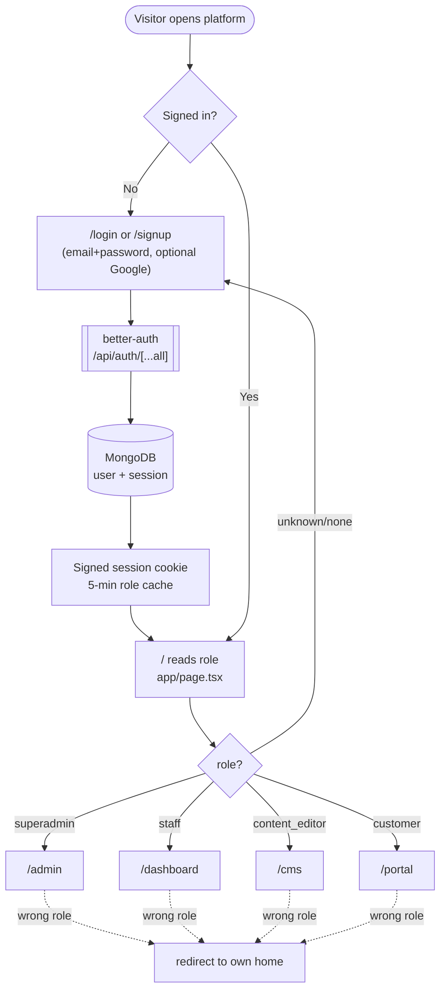
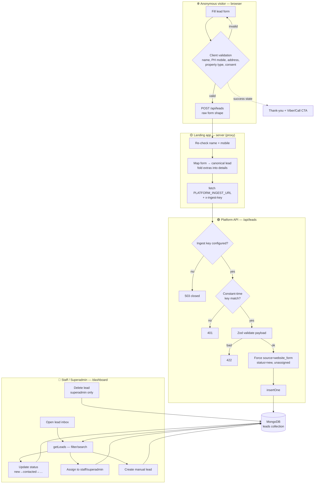
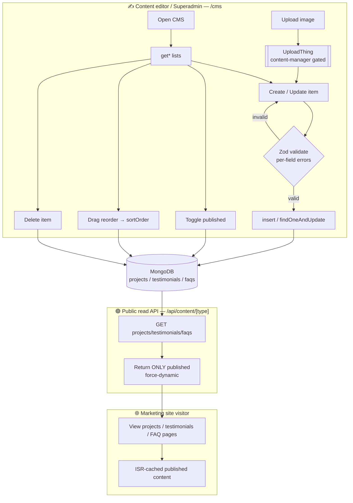
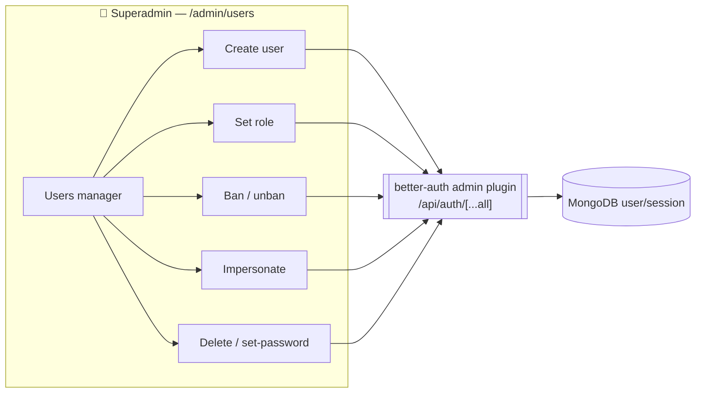
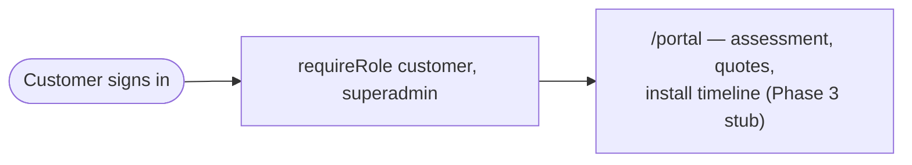

# User Flows and Swimlanes

> [!info] What this is
> A full-flow overview of how **every kind of user** moves through the two codebases — the public marketing site (`solarworks-landingpage/`) and the authenticated app (`solarworks-platform/`). Diagrams are Mermaid swimlanes (lanes = actors/systems). See [[Tech Stack and Architecture]] for the stack and [[Design System and Frontend Build]] for the UI layer.

## The cast (actors)

| Actor | Where they live | What they can do | Lands on |
|---|---|---|---|
| **Anonymous visitor** | Marketing site | Browse pages, read *published* content, submit the lead form | — |
| **Lead** | A MongoDB document, not a login | Created from the form; worked by staff. A lead is data, not a user account | — |
| **Customer** | Platform (`/portal`) | Track their own assessment / quotes / install (Phase 3 stub today) | `/portal` |
| **Staff** | Platform (`/dashboard`) | Read/create/update/**assign** leads; read-only on content | `/dashboard` |
| **Content editor** | Platform (`/cms`) | Full CRUD + publish on projects / testimonials / FAQs | `/cms` |
| **Superadmin** | Platform (everything) | All of the above **plus** user management and lead deletion | `/admin` |

Roles, permissions, and per-role home routes are the single source of truth in `solarworks-platform/lib/permissions.ts`. Auth is **better-auth** with the `admin` plugin over MongoDB (`lib/auth.ts`).

---

## 1. Master flow — who goes where after sign-in

Every authenticated request flows through `lib/session.ts` (`requireUser` / `requireRole`). The root route `app/page.tsx` reads the session role and redirects to that role's home (`ROLE_HOME`). Each section layout re-guards itself, so a customer who hand-types `/dashboard` is bounced back to `/portal`.

**Deny-by-default:** layouts call `requireRole(...)`. Default role for a fresh signup is `customer` (`DEFAULT_ROLE`). Only a superadmin can elevate someone.

---

## 2. Lead capture & management (the core business flow)

This is the spine of the product. A visitor's form crosses **two apps**, lands in Mongo as a `new`/unassigned lead, then staff work it. Note the two `/api/leads` routes: the landing one is a **same-origin proxy** (keeps the platform URL + ingest key off the browser); the platform one is the **authenticated ingest** that validates and writes.

**Server-side guarantees**
- The public ingest never trusts the caller: `source` is forced, lead always starts `new` + unassigned, payload bounded by Zod (`app/api/leads/route.ts`).
- Every dashboard action re-verifies the role server-side via `requireRole("staff","superadmin")`; **delete is `superadmin`-only** (`app/dashboard/actions.ts`).
- Assignment checks the target user is actually staff/superadmin before writing.
- Spam (Cloudflare Turnstile) + rate limiting sit *in front of* the landing proxy (NFR-02) — placeholder in the form today.

> [!note] Phase status
> The landing form posts for real to the proxy; the proxy → platform hop is live once `PLATFORM_INGEST_URL` + `LEADS_INGEST_KEY` are set. Google Sheets mirror + Resend notification are later phases (see [[Tech Stack and Architecture]]).

---

## 3. Content / CMS flow (editor → public site)

Content editors and superadmins manage projects, testimonials, and FAQs. Only **published** items leak out to the public read API the marketing site consumes.

**Guarantees**
- Every CMS action re-checks `requireRole("content_editor","superadmin")` (`app/cms/actions.ts`); staff get **read-only** content by the permission matrix.
- Image uploads are gated by the same content-manager check inside UploadThing middleware (`app/api/uploadthing/core.ts`), capped at 4 MB.
- The public content API exposes **no privileged data** — published content is public by definition, so no auth key; it returns the exact shape the landing app's old static modules used, making the static→live swap a near drop-in.

---

## 4. User management (superadmin only)

`adminRoles: ["superadmin"]` (`lib/auth.ts`) is what unlocks the admin plugin's user/session statements. No other role can reach these endpoints.

---

## 5. Customer portal (self-service)

Customers hold **no** admin-plugin permissions — they manage only their own portal data. Today the page is a Phase-3 placeholder.

---

## Permission matrix (from `lib/permissions.ts`)

| Resource / action | superadmin | staff | content_editor | customer |
|---|:--:|:--:|:--:|:--:|
| user/session admin | ✅ | — | — | — |
| lead: create/read/update/assign | ✅ | ✅ | — | — |
| lead: **delete** | ✅ | — | — | — |
| content: create/read/update/publish/delete | ✅ | read only | ✅ | — |
| own portal data | ✅ | — | — | ✅ |

---

## Cross-cutting notes

- **Two codebases, one design system.** Marketing (`solarworks-landingpage/`) and app (`solarworks-platform/`) are separate Next.js projects; see [[app-backend-architecture]] in agent memory and the white-label rationale in [[website-build-approach]].
- **Trust boundary** is the platform `/api/leads` ingest + every Server Action's `requireRole`. The browser never holds the ingest key or the platform URL.
- **Session strategy:** role is signed into a short-lived (5 min) cookie cache so layouts/redirects read it without a DB round-trip on every request (`lib/auth.ts`).
- **External systems** referenced in flows: Google OAuth (optional sign-in), UploadThing (CMS images), and — in later phases — Google Sheets (lead mirror), Resend (notifications), Cloudflare Turnstile (spam).

> [!tip] Keeping this current
> When you add a route, role, or action, update the matching swimlane and the permission matrix here so this note stays the human-readable map of "how every user works."
